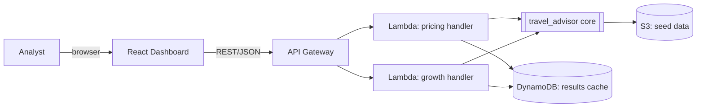

# Design — Travel Pricing & Growth Advisor

## Overview

Three deterministic Python modules (pricing, growth, storyline) sit behind thin API
handlers. Data comes from offline seed files plus the `holidays` library. AWS infrastructure
(CDK/TypeScript) fronts the handlers with API Gateway + Lambda and stores data/results in S3
and DynamoDB. A React dashboard consumes the API.

## Architecture

The core is import-only pure Python; handlers do the I/O. The same core runs locally (tests,
dev) and inside Lambda, so nothing on the critical path needs AWS to be exercised.

## Data model (backend/src/travel_advisor/models.py)

- `Market(code: str, country: str)` — e.g. `Market("BCN", "ES")`.
- `Route(code, origin, destination_market, base_fare: Decimal, floor: Decimal, ceiling: Decimal)`.
- `Event(market_code, date, name, impact: float)` — `impact >= 0`, demand multiplier boost.
- `Factor(kind, multiplier: float, reason: str)` — one contribution to a price/score.
- `PriceResult(price: Decimal, base: Decimal, factors: list[Factor])`.
- `MarketOpportunity(market, score: float)`.
- `Allocation(market, amount: Decimal)`.

## Pricing algorithm (pricing.py)

Pure function `price_for(route, travel_date, holidays, events, config) -> PriceResult`.

1. Start from `route.base_fare`.
2. Multiply by `seasonality(travel_date)` (bounded, e.g. 0.9–1.2) → record seasonality factor.
3. If a national holiday falls on `travel_date` in the destination market, multiply by
   `1 + holiday_boost` (boost ≥ 0) → record holiday factor.
4. For each event in the destination market within `proximity_days` of `travel_date`,
   multiply by `1 + event.impact` (impact ≥ 0) → record event factor.
5. Clamp the result to `[route.floor, route.ceiling]`.
6. Return `PriceResult(price, base, factors)`.

All multipliers for holidays/events are ≥ 1, so those factors can only hold or raise the
price before clamping — this is what makes requirements 2.4/2.5 hold.

## Growth algorithm (growth.py)

- `opportunity_score(market, expected_demand, margin) -> float`, monotonic non-decreasing in
  demand and margin, always ≥ 0.
- `allocate(total_budget, scores) -> list[Allocation]`: proportional to score
  (`amount_i = total * score_i / sum(scores)`), non-negative, summing to `total_budget` within
  a 1-cent rounding tolerance; if all scores are zero, split evenly. Higher score ⇒ ≥ allocation.
- `rank(markets) -> list[MarketOpportunity]`: sorted by descending score (stable).

## Storyline (storyline.py)

Pure function turning `PriceResult` + growth results into ordered plain-language insights.
Each insight references a real `Factor` or score; nothing is fabricated (requirement 4.3).

## API (api.py + infra)

- `GET /price?route=&date=&market=` → `PriceResult` JSON (5.1); 400 on invalid input (5.2).
- `GET /growth?budget=` → ranked markets + allocations JSON (5.3).
- `GET /storyline?route=&date=&market=&budget=` → storyline JSON.
Handlers validate input, call the pure core, and shape JSON. API Gateway + Lambda in CDK.

## Property-based testing (Lesson 4)

These are the general rules the implementation must always satisfy, tested with `hypothesis`
over generated routes, dates, holidays, and events. They map directly to requirements.

**Pricing**
- P1 (2.2/2.3): for any valid inputs, `floor <= price <= ceiling`.
- P2 (2.4): adding a holiday on the travel date never lowers the pre-clamp price vs. the same
  inputs without it.
- P3 (2.5): adding an event within the window never lowers the pre-clamp price.
- P4 (2.6): with no holidays and no events, the only non-seasonality factors are absent
  (factor list is exactly the seasonality factor).
- P5 (2.7): `price_for` is deterministic — equal inputs yield equal `PriceResult`.

**Growth**
- G1 (3.2): `sum(allocations) == total_budget` within 1-cent tolerance, for any non-negative
  budget and scores.
- G2 (3.3): every allocation amount is ≥ 0.
- G3 (3.4): if `score(a) > score(b)` then `allocation(a) >= allocation(b)`.
- G4 (3.1): `opportunity_score` is monotonic non-decreasing in expected demand.
- G5 (3.5): `rank` output is sorted by non-increasing score.

## Infrastructure (infra/, CDK v2 TypeScript)

One stack `TravelAdvisorStack`: S3 bucket (seed data), two Lambda functions (pricing, growth)
bundling the Python core, a REST API Gateway with the routes above, and a DynamoDB table
(results cache, on-demand billing). Validated via `npm run synth` → `cdk synth`; no
credentials required (requirement 7.2). Deploy is optional.

## Error handling

- Unknown route / missing params → typed errors mapped to 400 in the API (1.4, 5.2).
- Malformed event records are skipped during load, not fatal (1.3).
- Core functions raise on impossible states (e.g. floor > ceiling) rather than returning
  silently wrong numbers.

## Testing strategy

- `pytest` example-based tests for concrete scenarios (known holiday, known event).
- `hypothesis` property tests under `backend/tests/properties/` for P1–P5 and G1–G5.
- Infra: `cdk synth` in CI-style local run asserts a template is produced.
