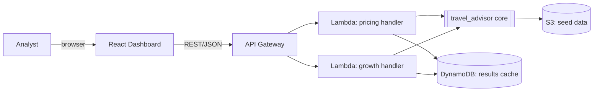

# Design — Travel Pricing & Growth Advisor

## Overview

Four deterministic Python modules (pricing, demand, growth, storyline) sit behind thin API
handlers. Data comes from offline seed files plus the `holidays` library. AWS infrastructure
(CDK/TypeScript) fronts the handlers with API Gateway + Lambda and stores data/results in S3
and DynamoDB; it is validated with `cdk synth` only and never deployed from this repo. A
React dashboard consumes the API.

Two complementary views of a price coexist on purpose:

- **Rule-based price** (`pricing.py`): the base fare adjusted by bounded, explainable
  multipliers. Fast to reason about, easy to audit, always within guardrails.
- **Profit-optimal price** (`demand.py`): the price that maximises expected profit under a
  price-elasticity demand curve and a hard seat capacity. This is where peak pricing comes
  from: it is *emergent* from the seat constraint, not a hand-tuned rule.

Both share the same contextual factors, so they never disagree about *why* a day is special;
they differ in *what* they do with that context.

## Architecture

The core is import-only pure Python; handlers do the I/O. The same core runs locally (tests,
dev) and inside Lambda, so nothing on the critical path needs AWS to be exercised.

## Data model (backend/src/travel_advisor/models.py)

- `Market(code: str, country: str)` — e.g. `Market("BCN", "ES")`.
- `Route(code, origin, destination_market, destination_country, base_fare: Decimal,
  floor: Decimal, ceiling: Decimal, seats: int, segment: str)` — `seats` is the capacity
  per departure; `segment` ("business" | "leisure") selects the demand elasticity.
- `Event(market_code, date, name, impact: float)` — `impact >= 0`, demand multiplier boost.
- `Factor(kind, multiplier: float, reason: str)` — one contribution to a price/score.
  `kind ∈ {seasonality, day_of_week, lead_time, holiday, event}`.
- `PriceResult(price: Decimal, base: Decimal, factors: tuple[Factor, ...])`.
- `BreakdownItem(kind, reason, multiplier, contribution_eur: Decimal, contribution_pct)` —
  one readable line of a price explanation; `base + Σ contribution_eur == price` exactly.
- `PricingRules` — every tunable loaded from `pricing-rules.json`: seasonality months and
  multipliers, `dow_multipliers` (Mon..Sun), `holiday_boost`, `proximity_days`, lead-time
  curve, `elasticity` + `elasticity_by_segment`, `base_demand_per_seat`,
  `marginal_cost_ratio`, `campaign_lead_days` (how far ahead of a demand peak ad campaigns
  must be live — the advisor dates its actions from it). Validated on construction
  (elasticities > 1, cost ratio in [0,1)).
- `RevenueOptimization(optimal_price, unconstrained_price, expected_demand,
  expected_revenue, expected_profit, marginal_cost, recommended, recommended_revenue,
  recommended_profit, demand_multiplier, elasticity, segment, seats,
  capacity_constrained, factors)` with derived `uplift_pct` and `load_factor`.
- `MarketOpportunity(market, score: float, demand_index, cpc_eur, margin_index)`.
- `Allocation(market, amount: Decimal)`.

## Pricing algorithm (pricing.py)

Pure function `price_for(route, travel_date, *, holiday, events, rules, reference_date=None)
-> PriceResult`. It reads no clock and no globals.

1. Start from `route.base_fare`.
2. Multiply by `seasonality(travel_date)` (month-based, e.g. 0.9–1.2) → seasonality factor.
3. Multiply by `dow_multipliers[weekday]` (weekend departures > mid-week) → day_of_week
   factor. Together with seasonality this is the always-present "time" context and is what
   gives consecutive quiet days *different* prices (req 2.8).
4. Only if `reference_date` is given: multiply by the advance-purchase curve
   `1 + lead_time_boost × remaining_share` (≥ 1). The calendar and `/price` endpoints do
   **not** pass it — the user compares departure dates, not booking horizons — so today no
   endpoint applies it; it is kept as a pure capability.
5. If a national holiday falls on `travel_date`, multiply by `1 + holiday_boost` (≥ 1).
6. For each event in the destination market with `distance = |event.date − travel_date|`,
   multiply by `1 + event.impact × w(distance)` where
   `w = max(0, (proximity_days + 1 − distance) / (proximity_days + 1))` — full impact on the
   event day, fading linearly to 0 just past the window (req 2.5). Still ≥ 1.
7. Clamp to `[route.floor, route.ceiling]`.
8. Return `PriceResult(price, base, factors)`.

Steps 4–6 are ≥ 1, so those factors can only hold or raise the pre-clamp price — this is
what makes requirements 2.4/2.5 (and properties P2/P3/P6) hold.

`price_breakdown(result) -> list[BreakdownItem]` replays the factors from the base fare,
attributing to each the euros it added or removed at that point of the chain, appends a
`guardrail` line if the clamp moved the price, and folds any cent-rounding residual into the
last line so the invariant `base + Σ contributions == price` holds exactly (req 2.9).

## Demand model and profit optimiser (demand.py)

Pure function `optimize_price(route, travel_date, *, holiday, events, rules)
-> RevenueOptimization`.

1. **Context → demand.** Call `price_for` and take the product of its factor multipliers as
   the day's `demand_multiplier` (an ordinary day is 1.0). *Design note:* these multipliers
   were calibrated as price adjustments; reusing them as a demand-context index is a
   deliberate simplification that guarantees the two views never disagree about a day.
2. **Demand curve.** Constant elasticity `e = rules.elasticity_for(route.segment)`:
   `demand(p) = base_demand × demand_multiplier × (p / base_fare)^(−e)` with
   `base_demand = base_demand_per_seat × seats`. Business segments have lower `e`.
3. **Objective.** Expected profit `(p − c) × min(demand(p), seats)`, with marginal cost
   `c = marginal_cost_ratio × base_fare`. The seat cap is the whole point: it is a hard
   physical limit, and it is what turns extra demand into a higher price.
4. **Search.** Deterministic grid over `[floor, ceiling]` (200 points) plus two analytical
   candidates: the unconstrained markup `p* = c·e/(e−1)` and the market-clearing price
   `p_c = base_fare × (base_demand × mult / seats)^(1/e)` where `demand(p_c) = seats`.
   Ties break toward the lower price. Result is clamped to the guardrails.
5. **Interpretation.** If `demand(p*) ≤ seats` the optimum is `p*` and
   `capacity_constrained = False`; otherwise the optimum is `≥ p*` (typically `p_c`) and
   `capacity_constrained = True` — peak pricing. The result also carries the rule-based
   price and its demand/revenue/profit for a like-for-like uplift.

Calibration (defaults in `pricing-rules.json`): `marginal_cost_ratio 0.30`, `e` 1.30
business / 1.45 leisure, `base_demand_per_seat 1.1`. With these, leisure routes are usually
capacity-bound (price set by seats, rising on event/holiday days) while business routes sit
at the markup with seat headroom — two different, explainable regimes.

## Growth algorithm (growth.py)

- `opportunity_score(market, expected_demand, margin) -> float`, monotonic non-decreasing in
  demand and margin, always ≥ 0.
- `allocate(total_budget, scores) -> list[Allocation]`: proportional to score
  (`amount_i = total * score_i / sum(scores)`), non-negative, summing to `total_budget` within
  a 1-cent rounding tolerance; if all scores are zero, split evenly. Higher score ⇒ ≥ allocation.
- `rank(markets) -> list[MarketOpportunity]`: sorted by descending score (stable).

## Storyline and advisor (storyline.py)

Pure functions turning engine results into plain language. Nothing is fabricated
(requirement 4.3): every sentence carries the figure it is derived from.

- `build_storyline(route, PriceResult, allocations) -> list[str]` — the original
  descriptive lines (price vs base, event drivers, budget split).
- `advisor_insights(route_label, [(date, RevenueOptimization)], rules) -> list[Insight]` —
  the consultant's voice as `Insight(kind, insight, action, evidence)` cards:
  - **peak**: the day with the highest demand multiplier, *only if* an event/holiday factor
    is behind it (a busy Friday is the weekday pattern, not a peak). Action = campaigns live
    by `peak − campaign_lead_days`.
  - **capacity**: how many days the seat cap sets the price, the span and the top price.
    Action = hold fare, move promo budget to non-capped days.
  - **uplift**: period profit at optimal vs rule-based prices (≥ 1% to be shown); action
    names the day with the largest single-day uplift.
  - **weekday**: cheapest vs dearest departure weekday straight from `dow_multipliers`.
  - **quiet**: no event/holiday in the window → always-on campaigns.
- `render_markdown_report(...) -> str` — consulting-style one-pager: headline numbers,
  recommendations (insight / action / evidence), day-by-day table (rule-based, optimal,
  capacity flag, load factor, profit, drivers), ad-budget split. Deterministic.

## API (api.py + infra)

- `GET /routes` → available routes with city labels.
- `GET /price?route=&date=` → `PriceResult` JSON incl. `breakdown` (5.1, 2.9); 400 on
  invalid input (5.2).
- `GET /optimize?route=&date=[&days=N]` → `RevenueOptimization` JSON (with the rule-based
  price's `breakdown`); with `days` returns `{route, days:[...]}` so the calendar needs one
  round trip (5.4, 5.5).
- `GET /growth?budget=[&route=&date=&days=]` → ranked markets + allocations + expected
  outcomes JSON (5.3).
- `GET /simulate?budget=&from=&to=&amount=` → what-if budget move.
- `GET /storyline?route=&date=&budget=[&days=]` → `{storyline: [...], advisor: [Insight]}`.
- `GET /onepager?route=&date=&days=&budget=` → deterministic SVG one-pager.
- `GET /report?route=&date=&days=&budget=` → Markdown report (`text/markdown`, served as a
  download by the dev server).
Handlers validate input (`_require`, `_parse_date`, `_parse_budget`, `_parse_days`), call the
pure core, and shape JSON. API Gateway + Lambda in CDK.

## Property-based testing (Lesson 4)

These are the general rules the implementation must always satisfy, tested with `hypothesis`
over generated routes, dates, holidays, and events. They map directly to requirements.

**Pricing**
- P1 (2.2/2.3): for any valid inputs and any ruleset, `floor <= price <= ceiling`.
- P2 (2.4): adding a holiday on the travel date never lowers the pre-clamp price vs. the same
  inputs without it.
- P3 (2.5): adding an event within the window never lowers the pre-clamp price.
- P4 (2.6): with no holidays, no events and no reference date, the factor list is exactly
  `[seasonality, day_of_week]`.
- P5 (2.7): `price_for` is deterministic — equal inputs yield equal `PriceResult`.
- P6: supplying a booking reference date (lead-time factor) never lowers the pre-clamp price.
- B1 (2.9): for any priced result, `base + Σ breakdown.contribution_eur == price` exactly.

**Demand / profit optimiser**
- D1 (2b.1): `floor <= optimal_price <= ceiling` for any inputs and ruleset.
- D2 (2b.1): profit at the optimal price ≥ profit at the floor and at the ceiling (it is a
  maximiser over the range), within grid tolerance.
- D3 (2b.7): `optimize_price` is deterministic.
- D4: demand is non-increasing in price for any positive elasticity.
- D5: whenever `ceiling >= marginal_cost`, `optimal_price >= marginal_cost` (never sell at a
  loss when the range allows it).
- C1 (2b.3): expected seats sold ≤ `seats`; `0 <= load_factor <= 1`.
- C2 (2b.4): `optimal_price >= unconstrained_price` (capacity only ever raises the price).
- C3 (2b.5): doubling `seats`, all else equal, never raises the optimal price.
- E1 (2b.2): the markup `c·e/(e−1)` is non-increasing in `e` — a less elastic segment
  sustains a higher (or equal) unconstrained price.

**Growth**
- G1 (3.2): `sum(allocations) == total_budget` within 1-cent tolerance, for any non-negative
  budget and scores.
- G2 (3.3): every allocation amount is ≥ 0.
- G3 (3.4): if `score(a) > score(b)` then `allocation(a) >= allocation(b)`.
- G4 (3.1): `opportunity_score` is monotonic non-decreasing in expected demand.
- G5 (3.5): `rank` output is sorted by non-increasing score.

## Infrastructure (infra/, CDK v2 TypeScript)

One stack `TravelAdvisorStack`: S3 bucket (seed data), two Lambda functions (pricing, growth)
bundling the Python core, a REST API Gateway with the routes above, and a DynamoDB table
(results cache, on-demand billing). Validated via `npm run synth` → `cdk synth`; no
credentials required (requirement 7.2). Deploy is optional.

## Error handling

- Unknown route / missing params → typed errors mapped to 400 in the API (1.4, 5.2).
- Malformed event records are skipped during load, not fatal (1.3).
- Core functions raise on impossible states (e.g. floor > ceiling) rather than returning
  silently wrong numbers.

## Testing strategy

- `pytest` example-based tests for concrete scenarios (known holiday, known event, weekday
  differentiation, event gradient, markup vs market-clearing price, breakdown sums).
- `hypothesis` property tests under `backend/tests/properties/` for P1–P6, B1, D1–D5,
  C1–C3, E1 and G1–G5. Strategies generate routes (incl. seats/segment), dates, events and
  full rulesets so every tunable is exercised.
- Infra: `cdk synth` in CI-style local run asserts a template is produced.
