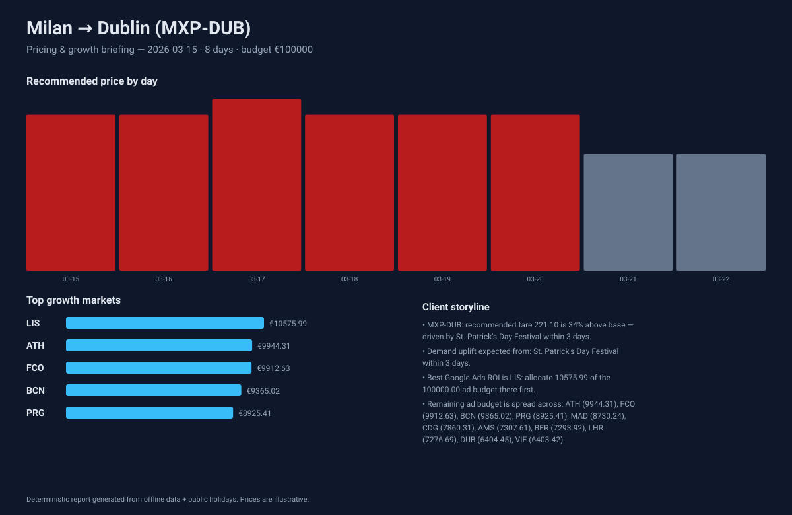
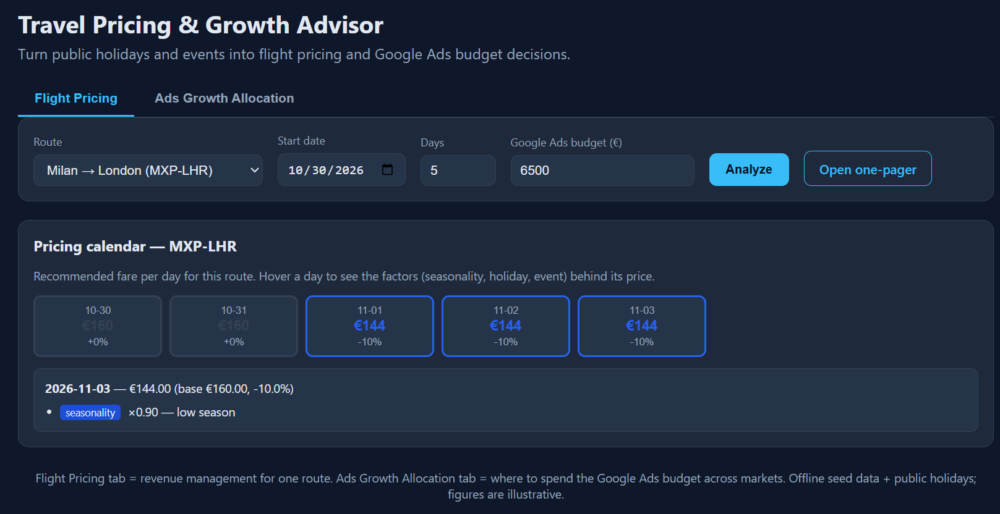
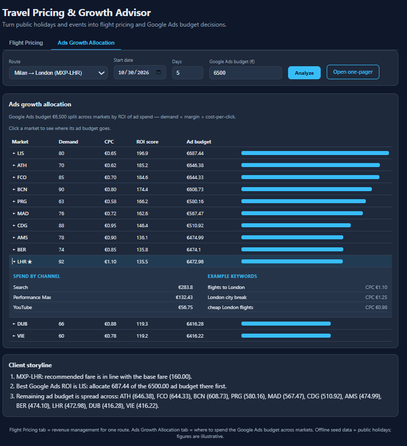
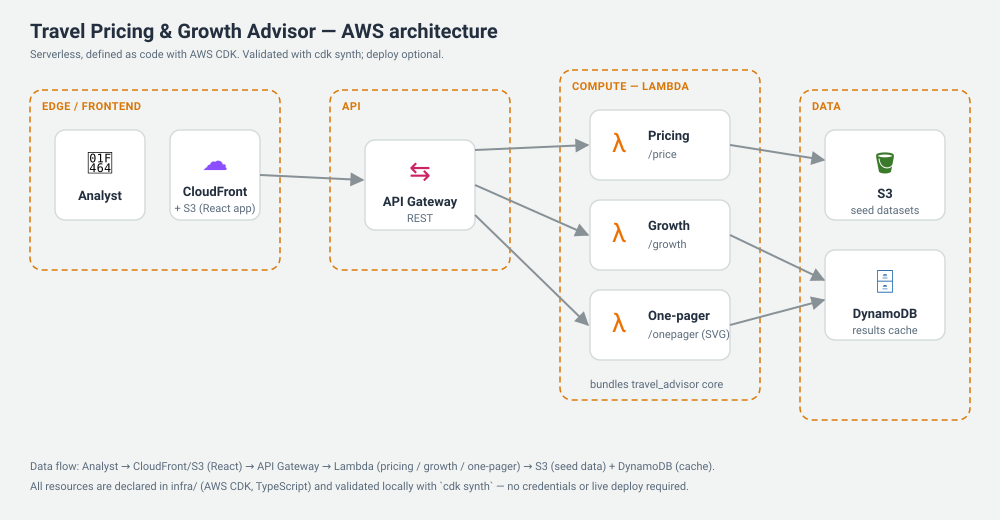

# Travel Pricing & Growth Advisor

An event-driven **dynamic pricing** and **Google Ads growth allocation** platform for the
travel vertical (airlines and OTAs like Booking / Expedia). It turns **public signals** —
national holidays and public events (trade fairs, concerts, sporting events) — plus
**advertising signals** (search demand and cost-per-click per market) into two decisions:
what to charge for a flight, and where to spend the ad budget. Both are explained in
business language a decision-maker can act on.

> Built during the **Kiro University Challenge 2026**. It demonstrates spec-driven
> development, steering, hooks, property-based testing, MCP, custom agents, and a packaged
> Kiro Power — around a real product, not a toy.

## What it does

The platform combines two tools travel businesses need side by side:

1. **Dynamic flight pricing** — recommends a fare per route and date that reacts to
   **seasonality, national holidays, and public events** (trade fairs, concerts, sporting
   events). Every price comes with the factors behind it, so a demand spike (e.g. Barcelona
   during Mobile World Congress) is visible before it happens (the **Flight Pricing** tab).
2. **Google Ads allocation advisory** — recommends **where to spend a Google Ads budget**
   across markets, ranked by **return on ad spend** (see below). It answers the
   international-growth-consultant question: given a fixed ad budget, which destinations
   return the most per euro spent? (the **Ads Growth Allocation** tab).

The two are linked: the holidays and events that lift a route's fares also boost that
market in the ads allocation, so a spike you see in pricing pushes that market up the ad
ranking. Both outputs are explained in plain business language and can be exported as a
one-pager.

**How the ROI is computed.** For each market:

```
ROI score = search demand × (1 + booking margin) ÷ cost-per-click
```

A euro of ad spend returns more where search demand is high, the booking margin is good,
and the cost-per-click is low. So a very popular but expensive market (e.g. London, high
CPC) can rank below a cheaper, high-margin one (e.g. Lisbon) — the budget follows ROI, not
raw popularity.

**Real demand signal (optional).** The `demand_index` in `data/markets.json` ships as
realistic seed values but can be refreshed from **live Google Trends** search interest:

```
pip install pytrends
python scripts/enrich_demand.py --dry-run   # preview
python scripts/enrich_demand.py             # write updated demand_index into the seed
```

This is offline-first by design: the script updates the **seed file** the app reads; the
app never calls the network at request time. If `pytrends` is missing or offline, the
script skips gracefully and leaves the seed untouched.

**Who uses it:** commercial and revenue teams at airlines, and growth teams at OTAs
(Booking, Expedia, eDreams) that run Google Ads across many markets. It is a B2B
decision-support tool, not a consumer booking app — the traveller only sees the resulting
price.

## The client one-pager

`GET /onepager` renders a fixed-layout, **deterministic** SVG briefing straight from the
engine — the report a growth consultant hands to a client. Same inputs produce a
byte-identical report.



*Milan → Dublin around St. Patrick's Day: the 17 March fare jumps +47% (Irish national
holiday **and** the St. Patrick's Day Festival), with the Google Ads budget split across
markets by ROI and the reasoning written out in the storyline.*

## The dashboard

**Flight Pricing tab** — the recommended fare per day for a route, coloured by uplift, with
the factors behind each day on hover.



**Ads Growth Allocation tab** — markets ranked by return on ad spend, each expandable to show
where its Google Ads budget goes (Search / Performance Max / YouTube + example keywords), plus
the client storyline. Here the analysed route's market (London ★) sits low despite the highest
demand, because its cost-per-click is the highest — the budget follows ROI, not popularity.



## What's inside

- **Interactive dashboard** (React + Vite) — a city-name route selector (12 EMEA routes), a
  pricing calendar that colours each day by uplift and reveals its factors on hover, a
  growth-opportunity board with per-market allocations, the storyline, and a one-click
  one-pager.
- **Pricing engine + growth advisor** (Python) — deterministic, explainable, fully tested
  (48 tests including property-based tests). Every price and score carries the factors that
  produced it.
- **AWS infrastructure as code** (CDK / TypeScript) — S3, Lambda, API Gateway, DynamoDB —
  validated with `cdk synth` (deploy optional, no credentials needed to validate).
- **Kiro artifacts** — spec, steering, hooks, custom agents, MCP config, and a packaged
  Power.

## Why it stands out

- **Deterministic core, proven by property tests.** Pricing and growth are pure functions;
  invariants (price stays within `[floor, ceiling]`, a holiday/event never lowers the price,
  allocations sum exactly to the budget, scores are monotonic) are verified over hundreds of
  generated inputs — and over **arbitrary rule configurations**, not just the defaults.
- **Ad-ROI growth allocation.** Markets are scored by return on ad spend — search demand
  and margin lift the score, a higher cost-per-click lowers it. A high-demand but expensive
  market (e.g. London) can rank below a cheaper, high-margin one (e.g. Lisbon): the budget
  follows ROI, not raw demand. Signals live in [`data/markets.json`](data/markets.json).
- **Extensible by data, not code.** Pricing behaviour (seasonality bands, holiday boost,
  event proximity) lives in [`data/pricing-rules.json`](data/pricing-rules.json). Advertising
  signals live in `data/markets.json`. A new destination is a row in
  [`data/routes.json`](data/routes.json) plus its events. Google Trends can optionally refresh
  the demand index via the bundled `fetch` MCP server (off by default; seed data stays the
  source of truth so the product always runs offline).
- **Curated, deterministic artifact.** The one-pager is a first-class output generated from
  the same engine, reproducible byte-for-byte.

## How it works (and where the numbers come from)

**Flight price.** Each route has a base fare in [`data/routes.json`](data/routes.json); the
recommended price is `base × seasonality × holiday × event`, clamped to the route's
`[floor, ceiling]`. The multipliers are transparent rules in
[`data/pricing-rules.json`](data/pricing-rules.json). Base fares are realistic seed values
for European short-haul, not a live carrier feed — in production the base fare comes from the
customer's revenue-management system; the adjustment logic stays the same.

**Ads ROI score.** For each market: `score = demand × (1 + margin) ÷ cpc`, where demand is a
search-interest index (0–100), margin is booking profitability (0–1), and CPC is the
cost-per-click for travel keywords — all in [`data/markets.json`](data/markets.json). A
high-demand but expensive market ranks below a cheaper, high-margin one, because the budget
follows return on ad spend. These signals are seed values; they can be refreshed from Google
Trends (demand) and Google Ads (CPC) via the bundled `fetch` MCP server. The model is real;
the data is seed and swappable.

**Pricing → allocation link.** When you analyse a route over a period, the holidays and
events that raise its fares also **demand-boost that market** in the ads allocation
(`score ×= uplift`, uplift ≥ 1). So a spike you see in the pricing calendar (e.g. Dublin at
St. Patrick's Day) pushes that market up the ads ranking — one coherent signal → price →
ad-ROI story.

**Where the ad budget goes.** Each market's allocation is broken down by channel
(Search / Performance Max / YouTube) and shown with example keywords and their CPC
(`data/ad-channels.json`), so "allocate €X to Lisbon" becomes concrete: how much on each
channel and which search terms it targets. Click a market in the dashboard to expand it.

**The one-pager** is not hand-drawn: it is rendered by code (`onepager.py`) from the same
engine outputs (the computed daily prices, the allocations, the storyline), and is
deterministic — identical inputs produce a byte-identical SVG.

## Architecture



A serverless AWS design defined as code with **AWS CDK** (TypeScript):

- **CloudFront + S3** serve the React dashboard at the edge.
- **API Gateway** (REST) fronts three **Lambda** functions — pricing, growth, and one-pager —
  each bundling the pure `travel_advisor` core.
- **S3** holds the seed datasets; **DynamoDB** caches results.

The core is pure Python (import-only); the Lambda/API layer does the I/O, so the same core
runs locally and in AWS and nothing on the critical path needs the cloud. All resources live
in `infra/` and are validated with `cdk synth` — no credentials or live deploy required.

## API

| Endpoint | Returns |
|----------|---------|
| `GET /routes` | available routes with city labels (`Milan → Barcelona (MXP-BCN)`) |
| `GET /price?route=&date=` | recommended price + the ordered factors behind it |
| `GET /growth?budget=` | markets ranked by opportunity + budget allocation |
| `GET /storyline?route=&date=&budget=` | business-language insights |
| `GET /onepager?route=&date=&days=&budget=` | deterministic SVG client briefing |

## Repository layout

```
travel-pricing-growth-advisor/
  backend/      Python core (pricing, growth, storyline, one-pager), API, tests
  infra/        AWS CDK (TypeScript) infrastructure as code
  frontend/     React + Vite dashboard
  data/         Seed datasets: routes, events, pricing-rules, and market ad signals
  power/        travel-growth-toolkit Kiro Power (skill + MCP)
  docs/         Kiro feature map + one-pager sample
  .kiro/        Steering, specs, hooks, agents, MCP settings
```

## Running it

```powershell
# Backend API (from backend/)
python -m venv .venv
.venv/Scripts/pip install holidays pytest hypothesis
$env:PYTHONPATH="src"; .venv/Scripts/python -m travel_advisor.server   # http://127.0.0.1:8000

# Tests (from backend/)
.venv/Scripts/python -m pytest -q

# Infrastructure validation (from infra/) — no AWS credentials needed
npm install && npm run synth

# Dashboard (from frontend/) — run alongside the backend
npm install && npm run dev                                             # http://localhost:5173
```

## Kiro feature coverage

Every Kiro University Challenge lesson is demonstrated in the repo. Full map in
[`docs/kiro-features.md`](docs/kiro-features.md):

| Lesson | Where |
|--------|-------|
| Spec-driven development | [`.kiro/specs/`](.kiro/specs/) — EARS requirements, design, tasks |
| Steering | [`.kiro/steering/`](.kiro/steering/) — product, tech, structure |
| Hooks | [`.kiro/hooks/`](.kiro/hooks/) — tests on backend save, type-check on frontend save, `cdk synth` on infra save |
| Property-based testing | [`backend/tests/properties/`](backend/tests/properties/) — pricing P1–P5, growth G1–G5 |
| Powers | [`power/`](power/) — `travel-growth-toolkit` (usage in its README) |
| MCP | [`.kiro/settings/mcp.json`](.kiro/settings/mcp.json) — optional `fetch` enrichment, off by default |
| Custom agents | [`.kiro/agents/`](.kiro/agents/) — `travel-data-analyst`, `aws-infra-reviewer` |
| Bonus — Package a Power | [`power/plugin.json`](power/plugin.json) |

## Status

Core product complete and verified: 48 tests green, `cdk synth` clean, dashboard and
one-pager working end-to-end. Optional next steps: live AWS deploy, a public demo, and
further visual polish.
