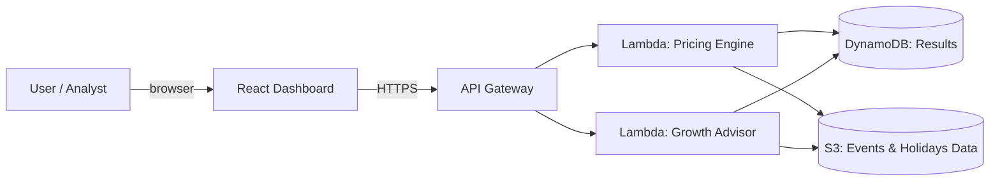

# Travel Pricing & Growth Advisor

An event-driven dynamic pricing and international growth advisory platform for the travel
vertical (airlines / OTAs). It turns **public signals** — national holidays and public
events (trade fairs, concerts, sporting events) — into **pricing decisions** and
**market-investment recommendations**, and explains them in business language a
decision-maker can act on.

> Built during the **Kiro University Challenge 2026** to demonstrate spec-driven
> development, steering, hooks, property-based testing, MCP, custom agents, and Kiro Powers.

## The business problem

Airlines and travel companies routinely leave revenue on the table because pricing and
market-investment decisions are made with static rules, spreadsheets, and intuition. This
platform answers four questions they actually ask:

1. **What price should this route sell at, on this date, for this market?** — dynamic price
   from seasonality, local holidays, and nearby events.
2. **Am I blind to incoming demand?** — surfaces demand spikes tied to events/holidays per
   market before they happen.
3. **Which international markets deserve more investment, and when?** — a growth-opportunity
   score ranks markets and suggests where to concentrate budget/capacity.
4. **How do I explain this decision convincingly?** — generates a "storyline": the key
   insights in plain business language with supporting charts.

## What the finished product includes

- **Interactive web dashboard** (React) — pricing calendar, events & demand timeline,
  growth-opportunity board, and a client-ready storyline view.
- **Pricing engine + growth advisor** (Python) — deterministic, explainable, fully tested
  including property-based tests.
- **AWS infrastructure as code** (CDK / TypeScript) — S3, Lambda, API Gateway, DynamoDB —
  validated with `cdk synth` (deploy optional).
- **Kiro artifacts** — spec, steering, hooks, custom agents, MCP config, and a packaged Power.

## Architecture



## Repository layout

```
travel-pricing-growth-advisor/
  backend/      Python pricing engine, growth advisor, and tests
  infra/        AWS CDK (TypeScript) infrastructure as code
  frontend/     React dashboard
  data/         Seed datasets (holidays, events, routes)
  .kiro/        Kiro steering, specs, hooks, agents
```

## Kiro feature coverage

This project demonstrates the Kiro University Challenge lessons. Full map in
[`docs/kiro-features.md`](docs/kiro-features.md):

- **Spec-driven development** — `.kiro/specs/` (EARS requirements, design, tasks)
- **Steering** — `.kiro/steering/` (product, tech, structure conventions)
- **Hooks** — `.kiro/hooks/` (tests on backend save, type-check on frontend save, `cdk synth` on infra save)
- **Property-based testing** — `backend/tests/properties/` (pricing P1–P5, growth G1–G5)
- **MCP** — `.kiro/settings/mcp.json` (optional event-enrichment `fetch` server, off by default)
- **Custom agents** — `.kiro/agents/` (`travel-data-analyst`, `aws-infra-reviewer`)
- **Power** — `power/` (`travel-growth-toolkit`: skill + MCP, packaged for reuse)

## Highlights

- **Deterministic core, proven by property tests.** Pricing and growth are pure functions;
  invariants (price bounds, holiday/event never lower the price, allocations sum exactly)
  are verified over hundreds of generated inputs — and over arbitrary rule configurations.
- **Extensible by data, not code.** Pricing behaviour (seasonality bands, holiday boost,
  event proximity) lives in `data/pricing-rules.json`. Add or tune a rule by editing data.
- **Client one-pager artifact.** `GET /onepager` renders a fixed-layout, deterministic SVG
  briefing (price chart + top growth markets + storyline) straight from the engine — the
  report a consultant hands to a client.

## Running it

```
# Backend API (from backend/)
python -m venv .venv && .venv/Scripts/pip install holidays pytest hypothesis
$env:PYTHONPATH="src"; .venv/Scripts/python -m travel_advisor.server   # http://127.0.0.1:8000

# Tests (from backend/)
.venv/Scripts/python -m pytest -q

# Infrastructure validation (from infra/)
npm install && npm run synth

# Dashboard (from frontend/)
npm install && npm run dev                                             # http://localhost:5173
```

## Status

Core product complete: backend + tests, property-based tests, API, CDK infra
(validated with `cdk synth`), and the dashboard all work. Remaining: presentation
polish (screenshots, richer datasets, frontend styling) and optional live AWS deploy.
See `.kiro/specs/travel-pricing-growth-advisor/tasks.md` for the task list.
