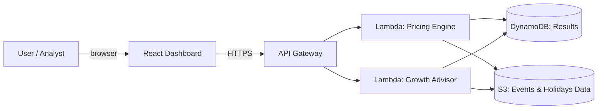

# Travel Pricing & Growth Advisor

An event-driven dynamic pricing and international growth advisory platform for the travel
vertical (airlines / OTAs). It turns **public signals** — national holidays and public
events (trade fairs, concerts, sporting events) — into **pricing decisions** and
**market-investment recommendations**, and explains them in business language a
decision-maker can act on.

> Built during the **Kiro University Challenge 2026** to demonstrate spec-driven
> development, steering, hooks, property-based testing, MCP, custom agents, and Kiro Powers.

## The business problem

Airlines and travel companies routinely leave revenue on the table because pricing and
market-investment decisions are made with static rules, spreadsheets, and intuition. This
platform answers four questions they actually ask:

1. **What price should this route sell at, on this date, for this market?** — dynamic price
   from seasonality, local holidays, and nearby events.
2. **Am I blind to incoming demand?** — surfaces demand spikes tied to events/holidays per
   market before they happen.
3. **Which international markets deserve more investment, and when?** — a growth-opportunity
   score ranks markets and suggests where to concentrate budget/capacity.
4. **How do I explain this decision convincingly?** — generates a "storyline": the key
   insights in plain business language with supporting charts.

## What the finished product includes

- **Interactive web dashboard** (React) — pricing calendar, events & demand timeline,
  growth-opportunity board, and a client-ready storyline view.
- **Pricing engine + growth advisor** (Python) — deterministic, explainable, fully tested
  including property-based tests.
- **AWS infrastructure as code** (CDK / TypeScript) — S3, Lambda, API Gateway, DynamoDB —
  validated with `cdk synth` (deploy optional).
- **Kiro artifacts** — spec, steering, hooks, custom agents, MCP config, and a packaged Power.

## Architecture



## Repository layout

```
travel-pricing-growth-advisor/
  backend/      Python pricing engine, growth advisor, and tests
  infra/        AWS CDK (TypeScript) infrastructure as code
  frontend/     React dashboard
  data/         Seed datasets (holidays, events, routes)
  .kiro/        Kiro steering, specs, hooks, agents
```

## Status

Work in progress — see `.kiro/specs/travel-pricing-growth-advisor/` for requirements,
design, and the implementation task list.
